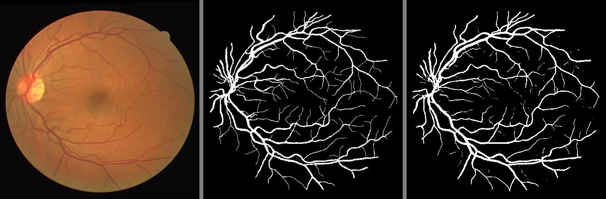

## Blood Vessel Segmentation using U-Net

## Overview

This project implements a U-Net architecture for segmenting blood vessels in retinal fundus images. The goal is to accurately identify and delineate the vascular structures, which is crucial for diagnosing various ocular diseases. The model is trained on a dataset of retinal images and their corresponding ground truth masks.

## Installation

To run this project, you need to have Python installed along with the following libraries:
```
pip install numpy opencv-python tqdm imageio albumentations torch torchvision
```

## Dataset

The dataset used in this project consists of retinal fundus images and corresponding masks that highlight the blood vessels. The data should be organized as follows:
Download Dataset: [Link](https://www.kaggle.com/datasets/zionfuo/drive2004?resource=download)

```
RetinaData/
    ├── training/
    │   ├── images/
    │   └── 1st_manual/
    └── test/
        ├── images/
        └── 1st_manual/

```

Make sure to place your `.tif` images in the `images` directory and the corresponding `.gif` masks in the `1st_manual` directory.

1. Clone the repository:

```
git clone https://github.com/ganjbakhshali/Vessel-Segmentation.git
cd Vessel-Segmentation

```

2. Prepare your dataset according to the structure mentioned above.
3. Run the training script:

```
run UNET for Retina Blood Vessel Segmentation.ipynb

```

## Results

The results of segmentation can be visualized by comparing predicted masks against ground truth masks. You can implement visualization functions to display these comparisons.
Results


In this image:
* Left: Input fundus image.
* Middle: Ground truth mask of blood vessels.
* Right: Output from the U-Net model.


## License

This project is licensed under the MIT License.  Feel free to contribute to this project by opening issues or submitting pull requests. Your feedback is highly appreciated!
